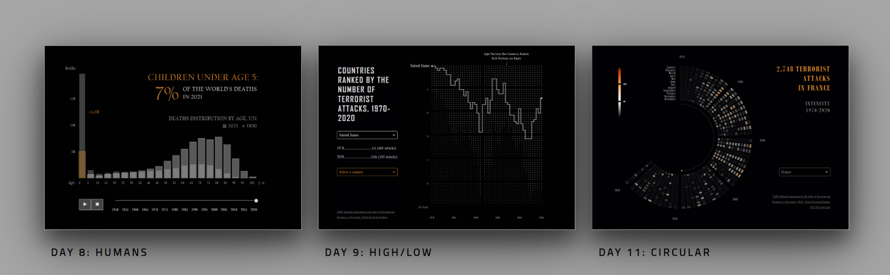

## Dashboard collection 

## About
This repo contains the code for the graphs I created for [30DayChartChallenge](https://github.com/30DayChartChallenge). The graphs were built in <b>Plotly</b>, and the dashboards, the app, and most of the navigation were created using <b>Dash</b>, <b>Bootstrap</b>, <b>HTML</b> and <b>CSS</b>. The given codes include only the part with graphs and allow you to reproduce similar visualizations, for example, in Jupyter.

## Viz description
| Viz | Description | Data Source | Code | 
| --- | --- | --- | --- | 
| Day 8: <b>Humans</b> | Overlaid bar charts + animations show how deaths declined by age category from 1950 to 2020. | UN | [Link](https://github.com/lomska/30-Day-Chart-Challenge-2023/blob/main/Day_08_Humans/day_08_chart_code.py) | 
| Day 9: <b>High/Low</b> | Using a line chart and a scatterplot, I show how countries around the world have ranked in the number of terrorist attacks from 1970 to 2020. | START (National Consortium for the Study of Terrorism and Responses to Terrorism). Global Terrorism Database | [Link](https://github.com/lomska/30-Day-Chart-Challenge-2023/blob/main/Day_09_High_Low/day_09_chart_code.py) | 
| Day 11: <b>Circular</b> | A radial heat map shows the intensity of terrorist attacks by month from 1970 to 2020 in 50 countries. | START (National Consortium for the Study of Terrorism and Responses to Terrorism). Global Terrorism Database | [Link](https://github.com/lomska/30-Day-Chart-Challenge-2023/blob/main/Day_11_Circular/day_11_chart_code.py) | 
